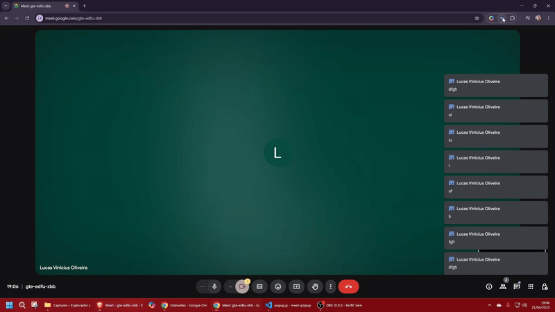
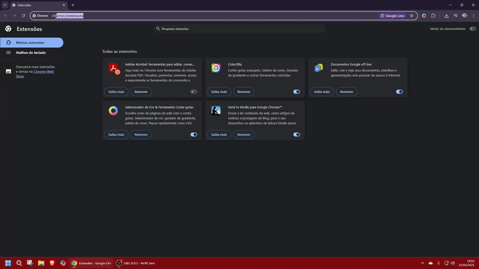

# Google Meet Notification Blocker

<div align="center">  
    
  
  <p>Extensão para Google Chrome desenvolvida com o objetivo de ocultar automaticamente os pop-ups de notificações de chat durante reuniões no Google Meet, promovendo maior foco e concentração.</p>  
</div>

## Demonstração Visual



_GIF mostrando o funcionamento completo da extensão_

## Tecnologias Utilizadas

- HTML5
- CSS3
- JavaScript (ES6+)
- Chrome API (Manifest V3)

## Instalação Local

```bash
git clone https://github.com/lucaxjordo/meet-notification-blocker.git
```

1. Acesse `chrome://extensions/` no Chrome
2. Ative o **Modo Desenvolvedor** no canto superior direito
3. Clique em **Carregar sem compactação** e selecione a pasta do projeto
   
   _GIF mostrando o processo de instalação da extensão no chrome extesnions_

## Como Utilizar

1. Entre em uma reunião no Google Meet
2. Localize o ícone da extensão na barra de ferramentas do Chrome:  
   
3. Controle as notificações:
   - **Ligado (Azul):** Notificações de chat ficam ocultas
     - Status: _"Notificações bloqueadas"_ (verde)
   - **Desligado (Cinza):** Notificações aparecem normalmente
     - Status: _"Notificações visíveis"_ (cinza)

## Desenvolvedor

## [](https://www.linkedin.com/in/lucasxoliva/)

## Contribuições

- Este projeto é de código aberto e aceita contribuições. Sinta-se à vontade para fazer um fork, abrir issues ou enviar pull requests.
